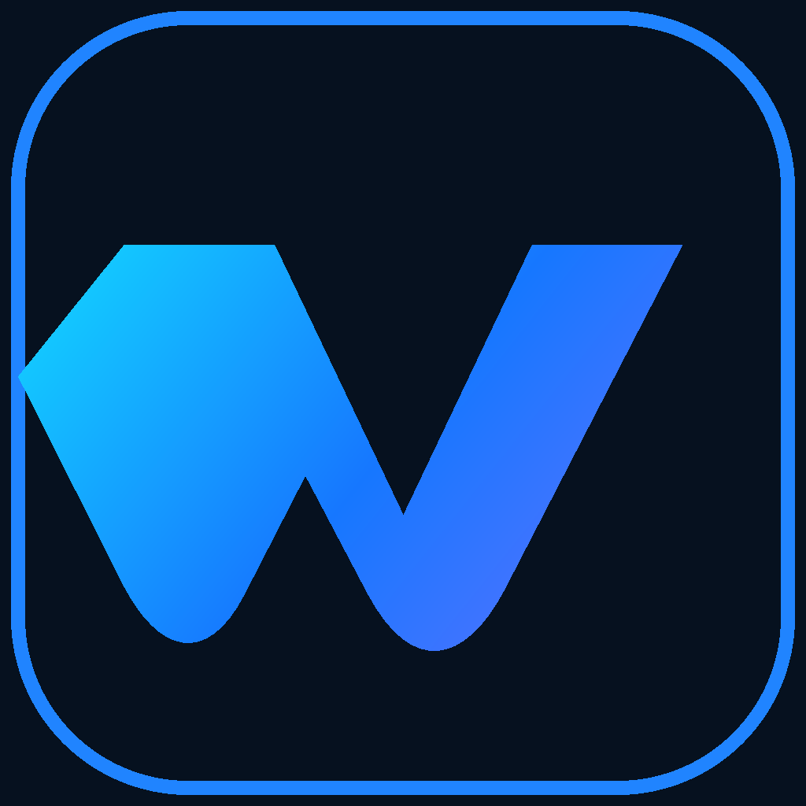
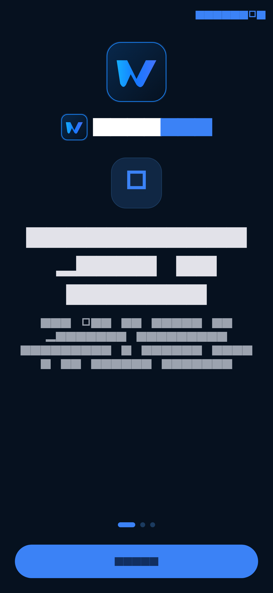
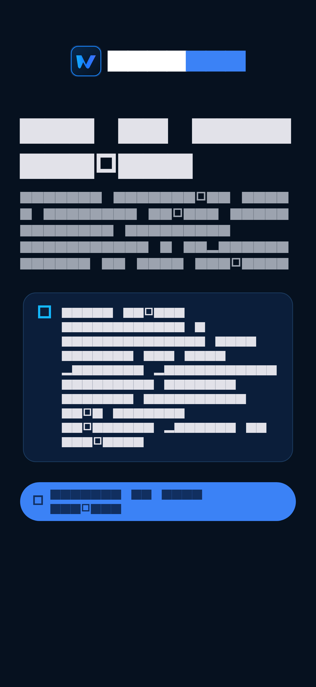
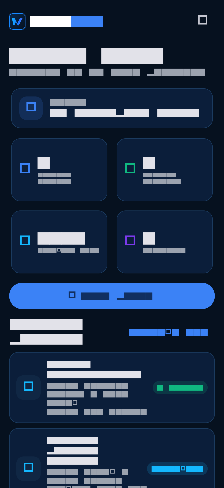
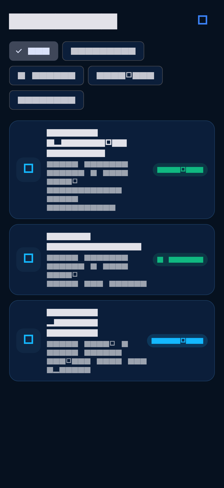
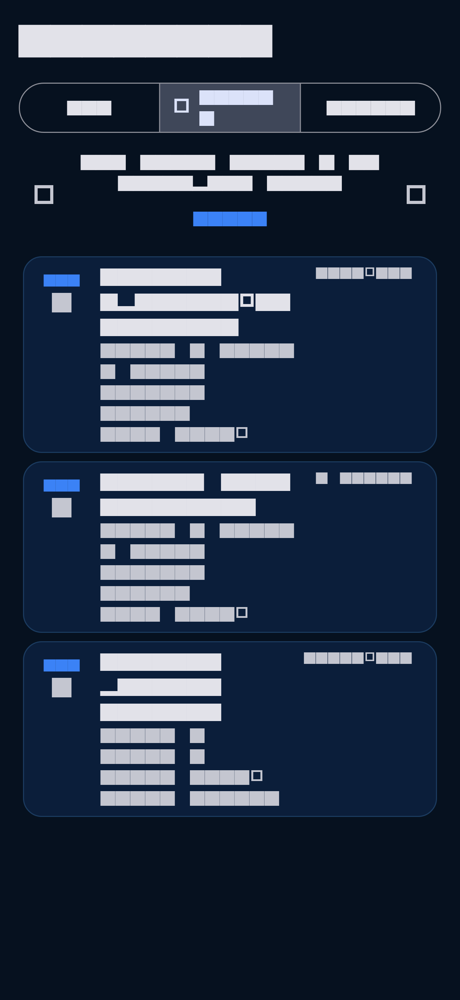
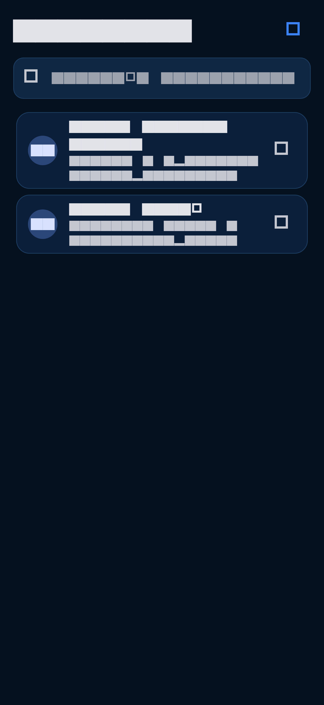

<p align="center">
  
</p>

<h1 align="center">WORKLOG</h1>

<p align="center">
  <strong>Terenski rad pod kontrolom.</strong><br>
  Poslovi, klijenti, vrijeme, fotografije, materijal, potpis i zapisnik u jednom premium mobilnom radnom toku.
</p>

<p align="center">
  <a href="https://github.com/bren-wp/WORKLOG/actions/workflows/ci.yml"></a>
  
  
  
  
  
</p>

<p align="center">
  
</p>

---

## WORKLOG u praksi

WORKLOG je Flutter aplikacija za Android i iOS namijenjena organizaciji terenskog rada. Trenutačna verzija radi **lokalno na uređaju** i ne predstavlja nepostojeći cloud/backend kao završenu funkciju.

Aplikacija već ima stvarne radne tokove za klijente, poslove, termine, statusni lifecycle, trajnu evidenciju vremena, materijal, bilješke, kontrolne liste, fotografije prije/poslije, potpis, PDF zapisnik, lokalne obavijesti, biometrijsku zaštitu te lokalni izvoz i brisanje podataka.

### Stvarni WORKLOG ekrani

Ove slike generira Flutter iz stvarnih produkcijskih widgeta aplikacije. Testni podaci postoje samo u screenshot capture testu i nikada se ne seedaju u produkcijsko stanje.

<table>
  <tr>
    <td align="center"><strong>Onboarding</strong><br></td>
    <td align="center"><strong>Lokalni pristup</strong><br></td>
    <td align="center"><strong>Dashboard</strong><br></td>
  </tr>
  <tr>
    <td align="center"><strong>Poslovi</strong><br></td>
    <td align="center"><strong>Kalendar</strong><br></td>
    <td align="center"><strong>Klijenti</strong><br></td>
  </tr>
</table>

## Glavne mogućnosti

- **Poslovi** — planirano, potvrđeno, na putu, u tijeku, pauzirano, završeno i otkazano.
- **Evidencija vremena** — više trajnih intervala, pauza/nastavak, oporavak nakon ponovnog učitavanja i ručna korekcija uz razlog.
- **Klijenti** — privatne osobe i poslovni subjekti, kontaktni podaci, adrese i povijest povezanih poslova.
- **Terenski tim** — članovi, uloge, dodjela poslova i zaštita od uklanjanja člana s otvorenim nalogom.
- **Kontrolna lista** — prilagodljive i trajno spremljene stavke po poslu, bez hardkodiranog demo sadržaja.
- **Fotografije** — kamera/galerija, lokalna pohrana i odvojene fotografije prije/poslije.
- **Potpis** — lokalno spremanje potpisa klijenta i uključivanje u zapisnik.
- **PDF** — lokalno generiranje i sistemsko dijeljenje zapisnika.
- **Kalendar** — pregled termina i direktno otvaranje poslova.
- **Sigurnost** — lokalna biometrija ili sigurnosna šifra uređaja, privatne Android obavijesti i zabrana cleartext HTTP prometa.
- **Privatnost** — bez analytics/ads SDK-a i bez lažnog cloud uploada u trenutnoj verziji.
- **Izvoz/brisanje** — lokalni izvoz aplikacijskog stanja i brisanje WORKLOG podataka.

## Android i iOS

| Mogućnost | Android | iOS |
| --- | :---: | :---: |
| Flutter produkcijski build | ✅ | ✅ |
| Minimalna verzija | API 24 | iOS 13 |
| Store target / SDK provjera | API 36 | Xcode 26 + iOS 26 SDK |
| Kamera i galerija | ✅ | ✅ |
| Biometrija / zaštita uređaja | ✅ | ✅ |
| Lokalne obavijesti | ✅ | ✅ |
| PDF i share sheet | ✅ | ✅ |
| Lokalna pohrana | ✅ | ✅ |
| Offline lokalni rad | ✅ | ✅ |
| Produkcijski store signing | 🔐 vlasnikov keystore | 🔐 Apple vjerodajnice |
| Cloud sinkronizacija | nije implementirana | nije implementirana |
| Serverska autentikacija | nije implementirana | nije implementirana |

## Branding

Primarni brand izvor je:

`assets/brand/worklog-mark.svg`

Produkcijski raster asseti generiraju se deterministički iz WORKLOG znaka:

- `assets/brand/generated/worklog-app-icon-1024.png`
- `assets/brand/generated/worklog-splash-mark-512.png`
- `store/android/assets/worklog-app-icon-512.png`
- `store/android/assets/worklog-feature-graphic-1024x500.png`
- `store/ios/assets/worklog-app-store-icon-1024.png`

Paleta:

| Uloga | Boja |
| --- | --- |
| Pozadina | `#06111F` |
| Površine | `#0B1E3A` |
| Primarna plava | `#3B82F6` |
| Uspjeh | `#10B981` |

Detalji: [docs/BRAND.md](docs/BRAND.md)

## Build

Preduvjet je aktualni Flutter stable koji zadovoljava `pubspec.yaml`.

### Priprema platformi

```bash
flutter create --org com.brendigo --project-name worklog --platforms android,ios .
python3 tool/configure_platforms.py
flutter pub get
```

### Provjera kvalitete

```bash
dart format --output=none --set-exit-if-changed lib test
flutter analyze
flutter test
```

### Android APK

```bash
flutter build apk --release
```

### Android AAB

```bash
flutter build appbundle --release
```

Ako nisu postavljene stvarne signing tajne, CI artefakt je jasno označen kao **CI/debug-signed i nije Play Store-ready**.

Potrebne tajne za produkcijski Android signing:

- `WORKLOG_ANDROID_KEYSTORE_BASE64`
- `WORKLOG_KEYSTORE_PASSWORD`
- `WORKLOG_KEY_ALIAS`
- `WORKLOG_KEY_PASSWORD`

Detalji: [docs/ANDROID-SIGNING.md](docs/ANDROID-SIGNING.md)

### iOS no-codesign release

```bash
flutter build ios --release --no-codesign
```

Standardni CI provjerava Xcode 26+, iOS 26+ SDK i archive-ready no-codesign build.

Za pravi IPA/TestFlight potreban je Apple Developer/App Store Connect pristup:

- `APPSTORE_ISSUER_ID`
- `APPSTORE_API_KEY_ID`
- `APPSTORE_TEAM_ID`
- `APPSTORE_API_PRIVATE_KEY`

Detalji: [docs/TESTFLIGHT.md](docs/TESTFLIGHT.md)

## CI/CD

`.github/workflows/ci.yml` na svakom PR-u i pushu na `main` provjerava:

1. Python platform/asset alate
2. Android/iOS platformsku konfiguraciju
3. WORKLOG brand/store assete
4. Dart format
5. `flutter analyze`
6. `flutter test`
7. Android release APK
8. Android release AAB
9. postojanje artefakata i SHA-256 checksumove
10. Xcode/iOS SDK zahtjeve
11. iOS release build bez codesigna
12. upload provjerenih GitHub Actions artefakata

## Store materijali

Google Play:

- listing: [store/google-play/hr-HR.md](store/google-play/hr-HR.md)
- ikona i feature graphic: `store/android/assets/`
- phone screenshotovi: `store/android/screenshots/phone/`

Apple App Store:

- listing: [store/app-store/hr-HR.md](store/app-store/hr-HR.md)
- App Store ikona: `store/ios/assets/`
- iPhone 6.9" screenshot set: `store/ios/screenshots/iphone-6.9/`

## Privatnost i compliance

- [PRIVACY.md](docs/PRIVACY.md)
- [STORE-COMPLIANCE.md](docs/STORE-COMPLIANCE.md)
- [ANDROID-SIGNING.md](docs/ANDROID-SIGNING.md)
- [TESTFLIGHT.md](docs/TESTFLIGHT.md)

Trenutačna verzija nema produkcijski backend, cloud sinkronizaciju ni serversku autentikaciju. To su namjerno eksplicitno označene granice, a ne skrivene demo funkcije.

## Preuzimanja

Najnoviji provjereni APK/AAB i iOS no-codesign paket trenutačno nastaju kao **GitHub Actions artefakti** u zelenom CI runu.

GitHub Release još se ne predstavlja kao stabilni store release dok aplikacija nema završenu produkcijsku autentikaciju/sinkronizaciju ili dok se proizvod konačno ne definira kao isključivo lokalni/offline alat.

[GitHub Actions](https://github.com/bren-wp/WORKLOG/actions) · [Releases](https://github.com/bren-wp/WORKLOG/releases)

## Status prema produkciji

### Završeno u repozitoriju

- premium dark WORKLOG identitet
- stvarni WORKLOG app/store icon asseti
- stvarni Flutter README/store screenshotovi
- Android API 36 / iOS 13 platforma
- APK/AAB i iOS no-codesign CI buildovi
- TestFlight workflow spreman za privatne Apple vjerodajnice
- sigurna signing konfiguracija bez privatnih ključeva u Gitu
- lokalni offline radni tokovi
- trajni timer i kontrolne liste
- privacy/store compliance dokumentacija

### Vanjski preduvjeti ili otvorena produkcijska arhitektura

- stvarni Android production keystore
- Apple Developer certificate/provisioning/App Store Connect vrijednosti
- Play Console i App Store Connect objava
- javni Privacy Policy/Support URL
- odluka i infrastruktura za produkcijsku serversku autentikaciju i cloud sync

## Licenca

MIT — vidi [LICENSE](LICENSE).
